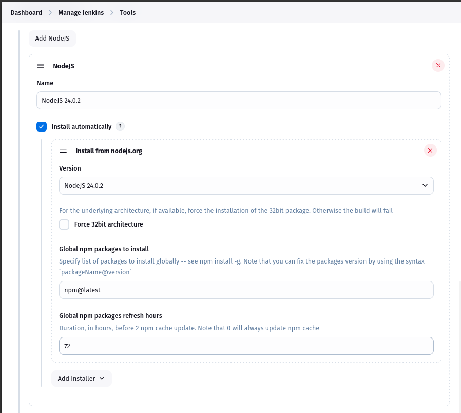
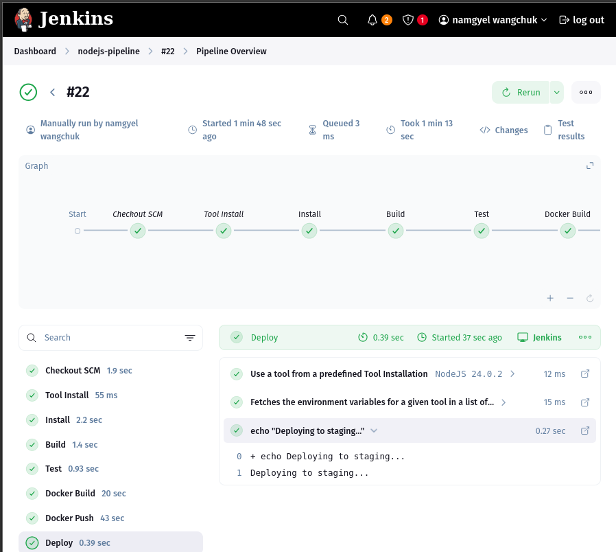
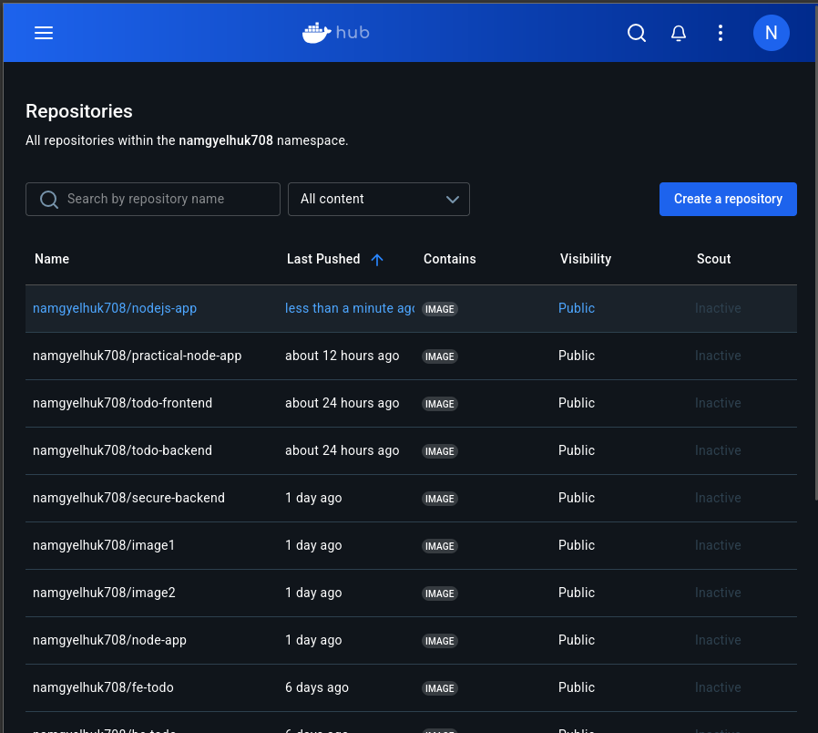
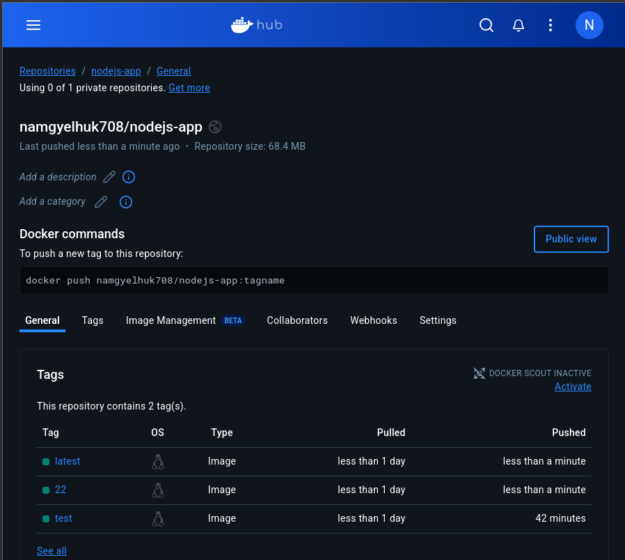

# Practical 5 & 6: Jenkins Declarative Pipeline with Docker Integration

## Overview

This project extends the Node.js application CI/CD pipeline from Practical 4 by incorporating Docker containerization and Docker Hub integration. The enhanced pipeline now automates building Docker images, pushing them to a container registry, and implementing branch-based deployment strategies.

## Implementation

### Part 1: Jenkins Pipeline Enhancement

#### Prerequisites

- Existing Jenkins setup from Practical 4
- Node.js application repository
- Docker installed on Jenkins server
- Docker Hub account

#### Configuration Steps

**Jenkins Plugin Installation**

Verified installation of required plugins:
- Docker Pipeline
- CloudBees Docker Build and Publish


**Node.js Configuration**

- Maintained NodeJS 24.0.4 configuration in Global Tool Configuration
- Ensured version alignment between Jenkins and Dockerfile



**Pipeline Setup**

- Created new pipeline job with SCM integration
- Configured to use Jenkinsfile from repository


#### Pipeline Stages

```groovy
pipeline {
  agent any
  tools {
    nodejs 'NodeJS 24.0.2'
  }
  environment {
    CI = 'true'
    DOCKER_IMAGE = "namgyelhuk708/nodejs-app"
    DOCKER_CREDENTIALS_ID = "dockerhub-creds"
  }
  stages {
    stage('Install') {
      steps {
        sh 'npm install'
      }
    }
    stage('Build') {
      steps {
        sh 'npm ci'
      }
    }
    stage('Test') {
      steps {
        sh 'npm test'
      }
      post {
        always {
          junit 'junit.xml'
        }
      }
    }
    stage('Docker Build') {
      steps {
        script {
          dockerImage = docker.build("${DOCKER_IMAGE}:${BUILD_NUMBER}")
        }
      }
    }
    stage('Docker Push') {
      steps {
        script {
          docker.withRegistry('', DOCKER_CREDENTIALS_ID) {
            dockerImage.push()
            dockerImage.push('latest')
          }
        }
      }
    }
    stage('Deploy') {
      steps {
        script {
          if (env.BRANCH_NAME == 'main') {
            sh 'echo "Deploying to production..."'
            // Add your production deployment commands here
          } else {
            sh 'echo "Deploying to staging..."'
            // Add your staging deployment commands here
          }
        }
      }
    }
  }
}
```

### Part 2: Docker Integration

#### Docker Configuration

**Dockerfile Implementation**

```dockerfile
# Use Node.js 20 (matches Jenkins setup)
FROM node:20-alpine

# Set working directory
WORKDIR /app

# Copy package files first (caching optimization)
COPY package*.json ./

# Install dependencies
RUN npm ci --only=production

# Copy app source
COPY . .

# Expose port 
EXPOSE 3000

# Start command
CMD ["npm", "start"]
```

**Local Testing**

Built and tested image locally:

```bash
docker build -t namgyelhuk708/nodejs-app:test .
docker run -p 3000:3000 namgyelhuk708/nodejs-app:test
```


**Docker Hub Setup**

- Created public repository: namgyelhuk708/nodejs-app
- Configured Jenkins credentials with ID dockerhub-creds


#### Security Implementation

- Used Jenkins credential binding for Docker Hub authentication
- Implemented branch-based deployment logic
- Added error handling in pipeline stages

## Challenges and Solutions

| Challenge | Solution | Evidence |
|-----------|----------|----------|
| Docker push authentication failures | Verified credential permissions and Docker Hub repository access | Updated credentials in Jenkins credential store |
| Node.js version conflicts | Standardized on Node 20 across Dockerfile and Jenkins | Modified Dockerfile to use node:20-alpine |
| Test reporting inconsistencies | Added explicit jest-junit configuration | Updated package.json test scripts |
| Docker build failures on Jenkins | Added Docker to Jenkins user group | Executed `sudo usermod -aG docker jenkins` |


## Results and Verification

- Successfully built and pushed Docker images to Docker Hub
- Verified automated image versioning through BUILD_NUMBER
- Confirmed branch-specific deployment logic execution
- Maintained all existing test reporting functionality








## Conclusion

This enhanced pipeline demonstrates:

- Complete automation from code commit to container deployment
- Secure handling of Docker Hub credentials
- Robust containerization of Node.js applications
- Effective branch-based environment management

The implementation provides a production-ready CI/CD workflow that combines the reliability of Jenkins with the portability of Docker containers.