# Jenkins CI/CD Pipeline Implementation for Node.js Application

## Objective

The goal of this assignment was to implement a Continuous Integration and Continuous Deployment (CI/CD) pipeline using Jenkins for a Node.js application. The pipeline automates:

- Code checkout from a Git repository
- Dependency installation
- Automated testing using Jest
- Test reporting via JUnit
- Simulated deployment steps

Security and best practices were applied to:

- Avoid hardcoding secrets in the Jenkinsfile
- Ensure reliable test execution through proper Jest configuration
- Generate structured and readable test reports for monitoring

## Implementation Steps

### 1. Jenkins Setup & Plugin Installation

To enable seamless Node.js and Git integration in Jenkins:

Installed essential plugins:
- **NodeJS Plugin** – for Node.js auto-installation
- **Git Plugin** – for SCM integration
- **Pipeline Plugin** – for defining pipelines as code
- **JUnit Plugin** – for test reporting

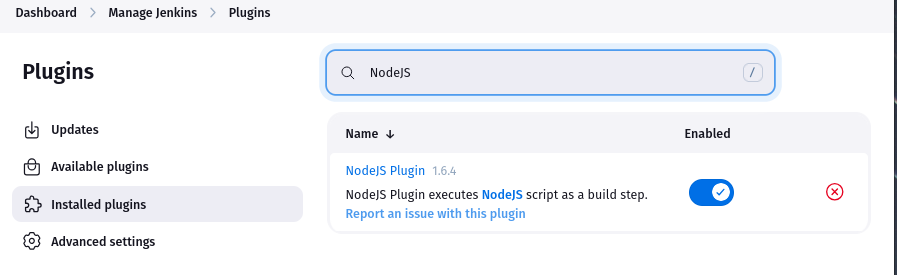
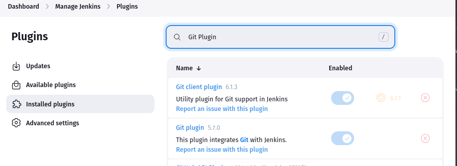
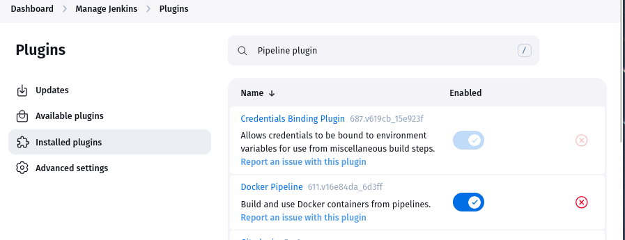
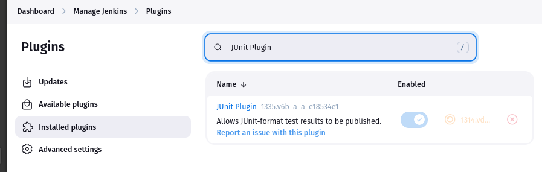

### 2. Node.js Configuration in Jenkins

- Configured Node.js 24.0.2 under Global Tool Configuration
- Ensured consistent runtime across local and CI environments
- Verified installation in the Jenkinsfile using:

```groovy
tools { nodejs 'NodeJS 24.0.2' }
```

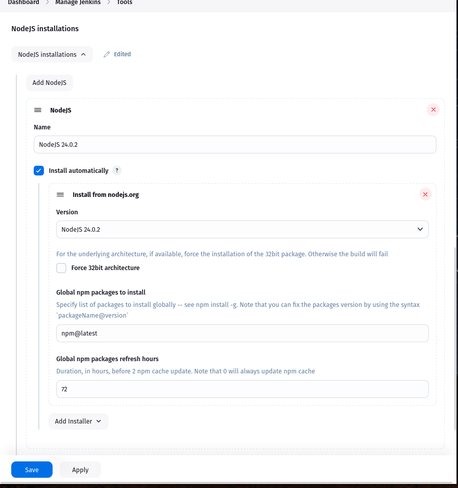

### 3. Pipeline Job Creation

- Created a Pipeline job in Jenkins
- Configured SCM integration with the Node.js GitHub repository
- Set Script Path to Jenkinsfile for pipeline-as-code setup

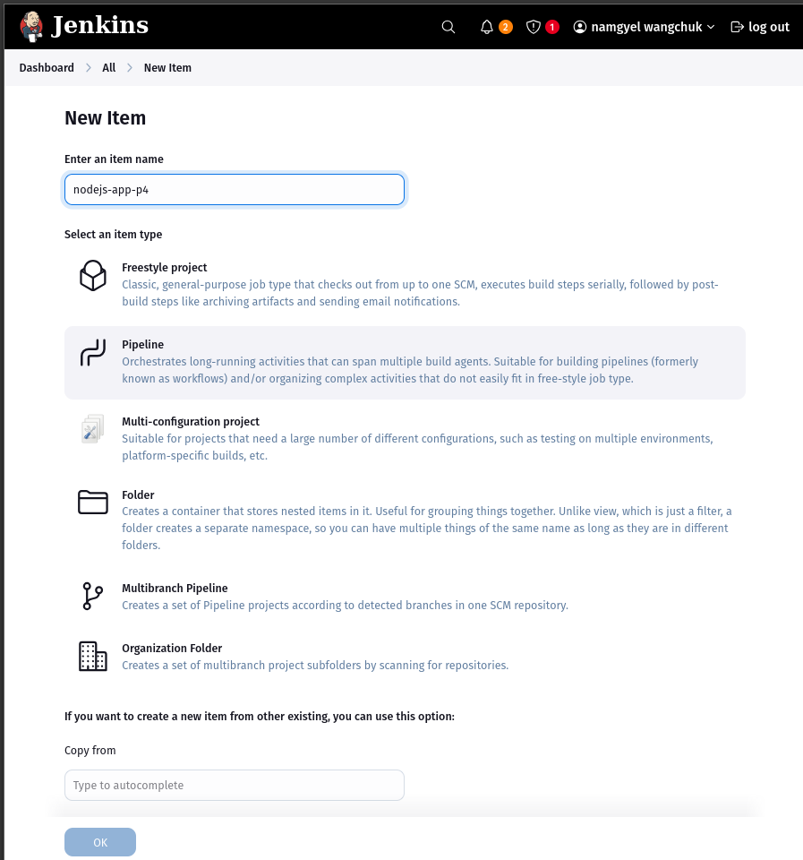

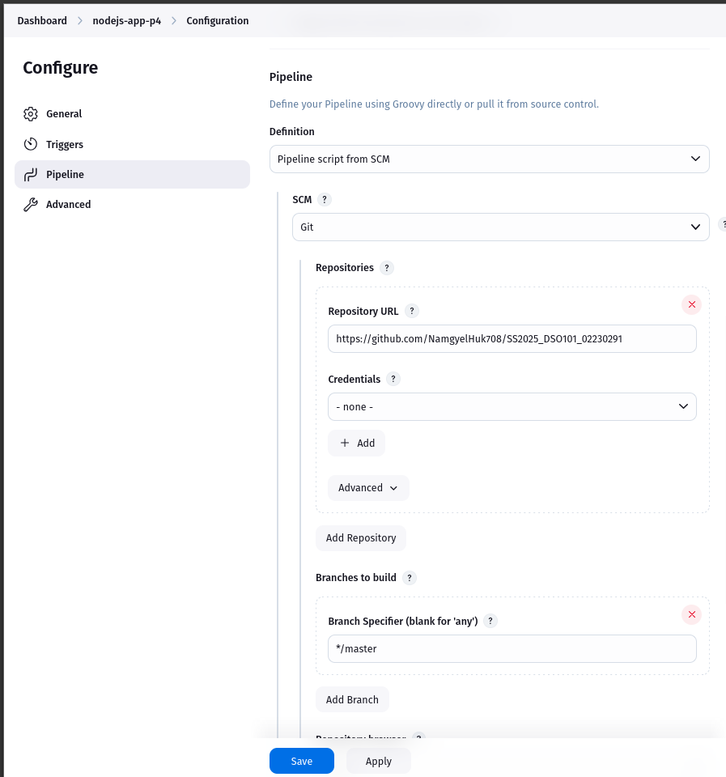

### 4. Jenkinsfile Implementation

Defined a declarative pipeline with multiple stages:

```groovy
pipeline {
  agent any
  tools {
    nodejs 'NodeJS 24.0.2' 
  }
  
  stages {
    stage('Checkout') {
      steps {
        checkout scm
      }
    }
    
    stage('Install') {
      steps {
        sh 'npm install'
      }
    }
    
    stage('Test') {
      steps {
        sh 'npm run test:ci'
      }
      post {
        always {
          junit 'junit.xml'
          archiveArtifacts artifacts: 'junit.xml', fingerprint: true
        }
      }
    }
    
    stage('Build') {
      steps {
        sh 'npm run build'
      }
    }
    
    stage('Deploy') {
      steps {
        sh 'echo "Deploying to staging..."'
      }
    }
  }
  
  post {
    always {
      archiveArtifacts artifacts: 'coverage/**/*', fingerprint: true
    }
  }
}
```

- **Checkout:** Pulls the latest code
- **Install:** Installs project dependencies
- **Test:** Runs Jest with JUnit reporting
- **Deploy:** Simulates deployment with a shell command

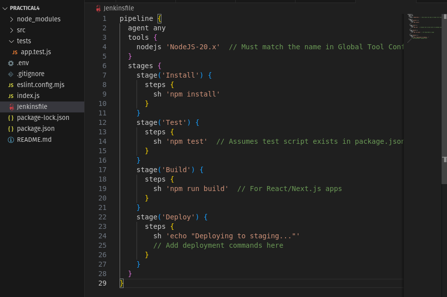

Successfully tested in the terminal

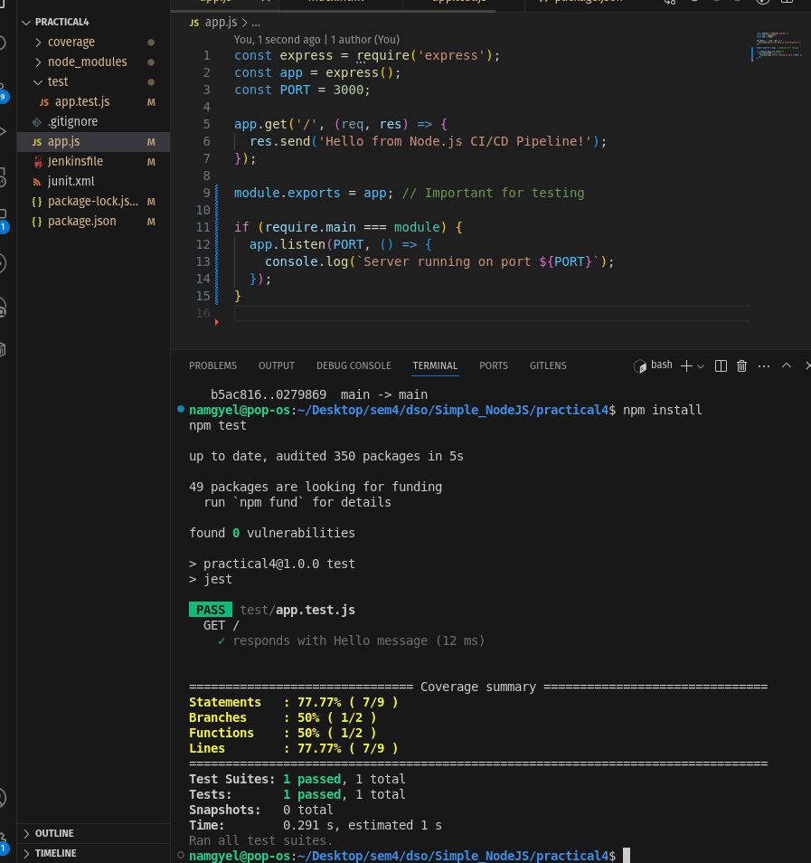

### 5. Automated Testing with Jest & JUnit Reporting

Configured the package.json with the following test scripts:

```json
"scripts": {
  "test": "jest",
  "test:ci": "jest --ci --reporters=default --reporters=jest-junit --coverage"
}
```

- Used jest-junit to output results in junit.xml
- Jenkins uses the JUnit plugin to display test results

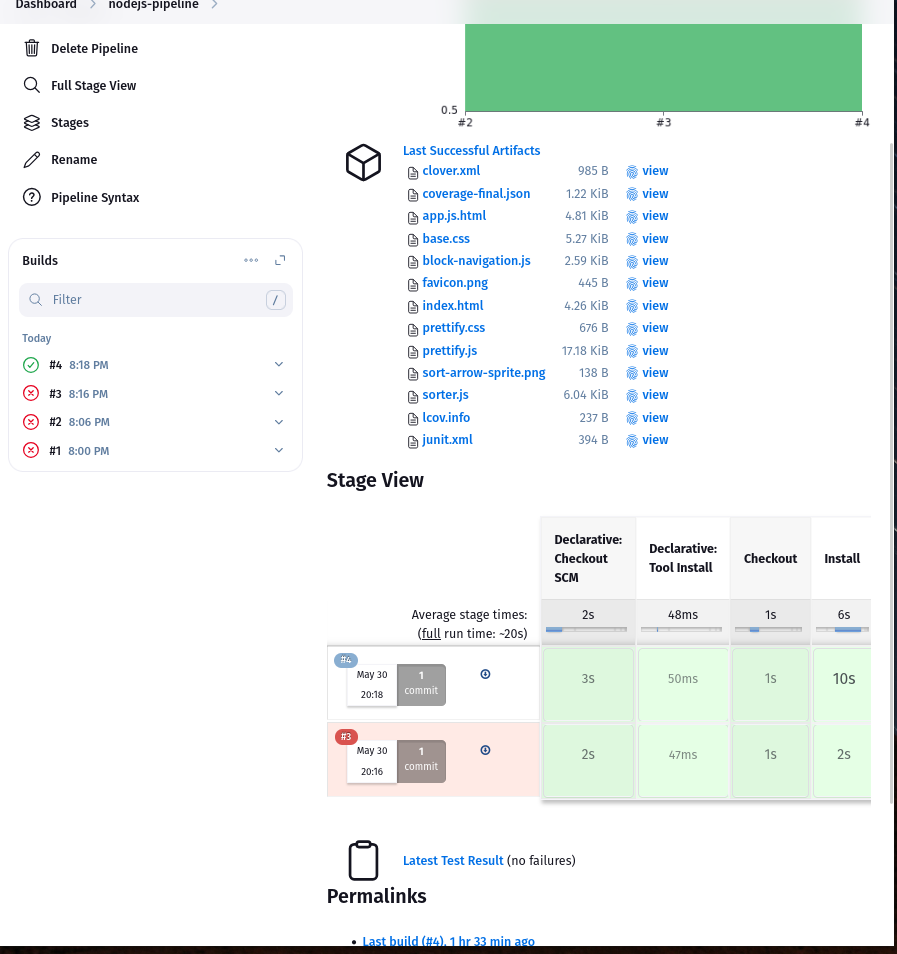

successfully build

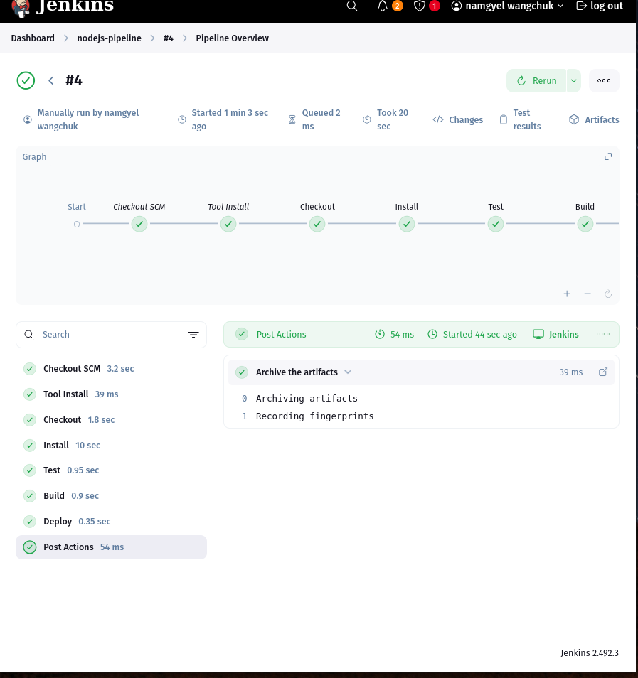 

## Challenges Faced & Solutions

### Test Stage Failing (Missing Test Files)

- **Problem:** Jest did not detect test files, causing the test stage to fail.
- **Solution:** Renamed test files to follow Jest's naming convention (*.test.js).

### JUnit Report Not Generated

- **Problem:** Test results were not visible in Jenkins.
- **Solution:** Installed jest-junit and correctly configured the output path as junit.xml.

### Node.js Version Mismatch

- **Problem:** Jenkins used a different Node.js version than the local environment.
- **Solution:** Set Node.js 24.0.2 in Jenkins' Global Tool Configuration to match the development setup.


### Pipeline Syntax Errors in Jenkinsfile

- **Problem:** Initial Jenkinsfile had syntax issues like misused quotes and blocks.
- **Solution:** Reviewed and corrected syntax using the Jenkins console log and linter.

## Key Learnings

- **Pipeline as Code** using Jenkinsfile supports version-controlled and maintainable automation
- **Automated Testing** ensures quality and early bug detection in CI pipelines
- **Security Best Practices** such as externalizing credentials strengthen the pipeline
- **Tool Integration** with NodeJS, Git, and JUnit makes Jenkins powerful and extensible
- **Debugging Techniques** like using test logs and console outputs helped quickly resolve failures

## Conclusion

This assignment successfully implemented a secure, maintainable, and automated CI/CD pipeline for a Node.js application using Jenkins.